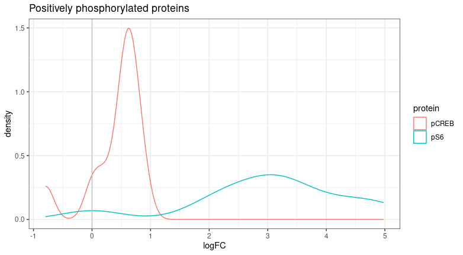
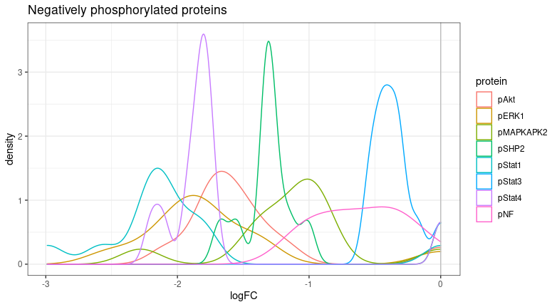

```{r setup, include=FALSE}
knitr::opts_chunk$set(echo = TRUE)
```


## Prior Knowledge Network
We built a prior knowledge network (PKN) with proteins as nodes and directed interactions as edges (inhibition and activation). PKN was built using [Omnipath](https://omnipathdb.org/) with [SIGNOR](https://signor.uniroma2.it/) database. 

Based on experimental data, we studied the following proteins:

 * **Initial nodes**: TLR7, TLR9
 * **Protein of interest (POI's)**: pAkt, pCREB, pERK1/2, pMAPKAPK2, pS6, pSHP2, pStat1, pStat3, pStat4, pTyrosina, pNF-kB-p65
 
TLR7 and TLR9 were used as intital nodes whereas POI's were used as final nodes. First, we identify paths between initial nodes and POI's. In addition, some interactions that were not present in SIGNOR were manually added, such as TBK1 --> IRF5 and TLR7 --> MYD88. The above network was used as first approximation in the following experiments.


## Cytof data
Medians of cytof data were ```log2``` normalized and ```logFC``` was calculated, according to control experiment (NO STIM/Anticuerpos). Of the 10 proteins measured, 2 was significantly positively regulated, while 8 was significantly negatively regulated.





## Model optimization 
Model was optmizated with [CellNOptR](https://saezlab.github.io/CellNOptR/) package. In summary, we explored the space of possible combinations of expanded gates (see [CellNOptR](https://saezlab.github.io/CellNOptR/)) in the PKN in order to fin the combinations that reproduces most closely the data. Comparison between model and data is obtained by simulating the steady state behaviour of the model under all conditions present in the data, and comparing these binary values to the normalised data points. The model was optimized with a Genetic Algorithm (GA).

The following plot shows binary simulated data (blue dashed lines) versus Cytof normalized data (black smooth lines) at different timepoints. Color background refers to difference between simulated and real data.


## Final model
Finally, GA has optimized the network as follows. Gray edges were removed from initial PKN. The purple nodes refer to those nodes that are repeated in networks generated at all time points.


## NOTES

1. **pTyrosina** was removed from POI's since it is not associated with any protein or gene.
2. Is it necessary to manually add any other interaction?
3. CellNOptR allows optimization using another algorithm, shall we try it?
